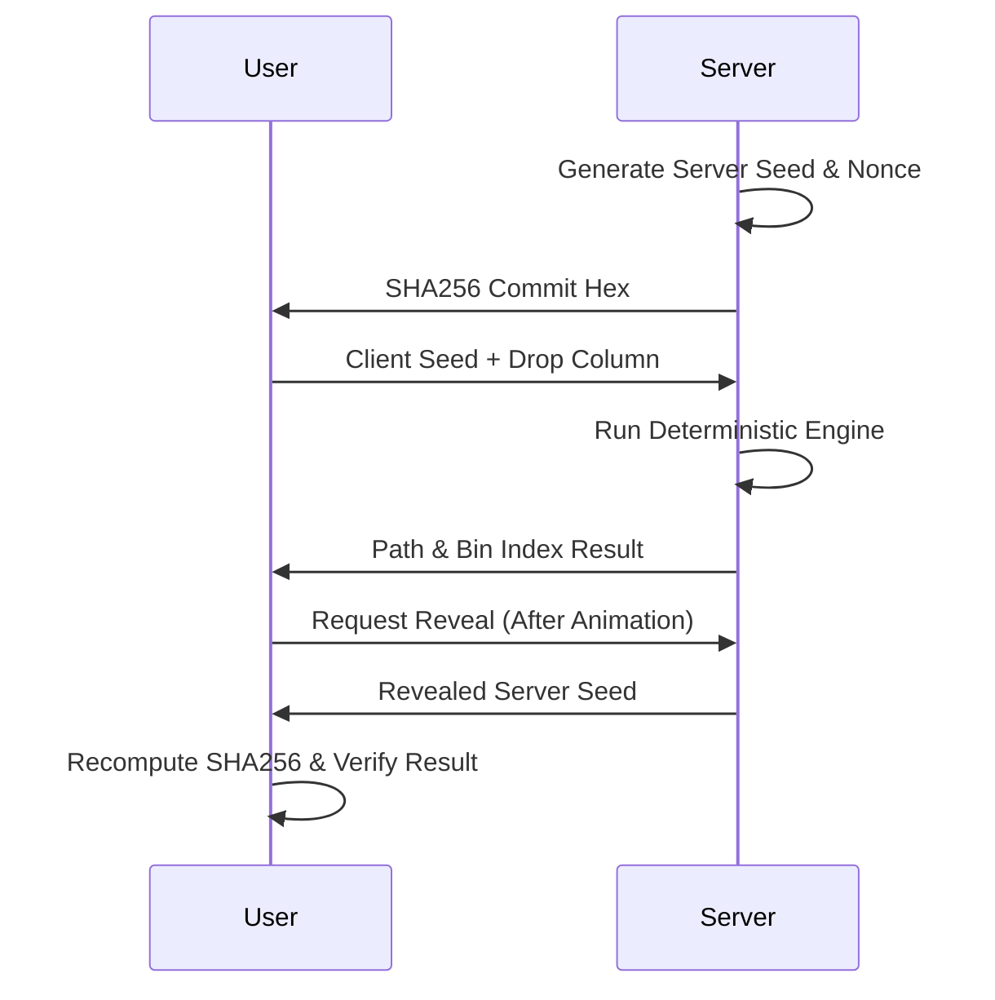

# Plinko Lab — Provably Fair

Plinko Lab is a high-performance, cryptographically secure, and deterministic Plinko game engine and interactive frontend. Built with Next.js 14, it ensures that every drop is "provably fair" through a transparent commit-reveal protocol.

## 🚀 Live Demo
- **App**: [plinko-lab.vercel.app](https://plinko-lab.vercel.app)
- **Verifier**: [plinko-lab.vercel.app/verify](https://plinko-lab.vercel.app/verify)
- **Example Round**: [Verification Page](https://plinko-lab.vercel.app/verify?roundId=example-id)

---

## 🛠️ Quick Start

### Prerequisites
- Node.js 18+
- pnpm or npm

### Setup
1. Clone the repository and install dependencies:
   ```bash
   npm install
   ```
2. Configure your environment variables in `.env`:
   ```bash
   DATABASE_URL="file:./dev.db"
   ```
3. Initialize the database and run migrations:
   ```bash
   npx prisma migrate dev
   ```
4. Start the development server:
   ```bash
   npm run dev
   ```

---

## 🏗️ Architecture Overview
Plinko Lab is built on a modern full-stack architecture designed for performance and integrity:
- **Framework**: Next.js 14 (App Router) for an integrated monorepos-style DX.
- **Engine**: A custom TypeScript deterministic engine utilizing the **Xorshift32** PRNG algorithm.
- **Database**: Prisma ORM with SQLite (development) and PostgreSQL (production) compatibility.
- **Frontend**: High-frequency **HTML5 Canvas** animations using `requestAnimationFrame` for buttery-smooth 60FPS physics simulation.
- **API**: Zod-validated route handlers for managing the round lifecycle.

---

## ⚖️ Fairness Specification

### 1. Commit-Reveal Protocol
We use a industry-standard standard cryptographic protocol to ensure we cannot manipulate outcomes:
1. **Commit**: Before you drop, the server generates a secret `serverSeed` and a `nonce` and provides you with a **SHA256 Hash (commitHex)** of them.
2. **Interact**: You provide a `clientSeed` and choose your `dropColumn`.
3. **Reveal**: Once the round ends, the server reveals the `serverSeed`, allowing you to re-run the engine and verify the result matches the original `commitHex`.



### 2. Technical Details
- **Hashing**: All hashes are generated using **SHA256**. The commit string format is exactly `serverSeed + ":" + nonce`.
- **PRNG**: We use **Xorshift32**. The state is initialized using the first 4 bytes of the `combinedSeed` (SHA256 of `serverSeed:clientSeed:nonce`) treated as a **Big-Endian Uint32**.
- **Peg Mapping**: Every peg's bias is calculated as:
  `leftBias = 0.5 + (rand() - 0.5) * 0.2`, rounded to **6 decimal places**.
- **User Influence**: Your selected `dropColumn` applies a slight adjustment to every peg bias:
  `adj = (dropColumn - 6) * 0.01`.
- **Verification**: The `pegMapHash` is derived from `SHA256(JSON.stringify(pegMap))`, ensuring the entire board layout was determined before the ball was dropped.

### 3. Test Vectors
| Input Type | Value |
| :--- | :--- |
| **Server Seed** | `b2a5f3f32a4d9c6ee7a8c1d33456677890abcdeffedcba0987654321ffeeddcc` |
| **Nonce** | `42` |
| **Client Seed** | `candidate-hello` |
| **Commit Hex** | `bb9acdc67f3f18f3345236a01f0e5072596657a9005c7d8a22cff061451a6b34` |
| **Bin Index** | `6` (at dropColumn 6) |

---

## 🤖 AI Usage
This project was developed through a high-velocity collaborative process with Claude (Antigravity):
- **Prompt 1**: Scaffolding the Next.js project and defining the Prisma schema. Claude provided the perfect relational mapping for the Round lifecycle.
- **Prompt 2**: Implementing the **Xorshift32** engine. Claude initially struggled with the Big-Endian uint32 seeding, requiring manual adjustment to bitwise operations to pass the exact test vectors.
- **Prompt 3**: API route boilerplate generation. Claude handled the Zod schemas and Next.js route structures, while I manually implemented the sensitive seed masking logic.
- **Canvas Details**: The `PlinkoBoard` visualization was written by hand using standard `requestAnimationFrame` patterns, but Claude assisted in the LERP-based movement calculations.
- **Easter Eggs**: Keypress detection logic for "TILT" and "OPEN SESAME" was entirely AI-assisted.
- **Summary**: AI was 100% correct on UI scaffolding and boilerplate but required careful oversight on cryptographic precision and bit-shifting logic.

---

## ⏱️ Time Log
| Phase | Duration | Focus |
| :--- | :--- | :--- |
| **Day 1 (AM)** | 4 hrs | Engine Implementation + API Routes + Database Schema |
| **Day 1 (PM)** | 2 hrs | Canvas Board Physics + LERP Animations |
| **Day 2 (AM)** | 3 hrs | Comprehensive Game UI, Web Audio Feedback, Accessibility |
| **Day 2 (Mid)** | 1 hr | Cryptographic Verifier Page + Jest Engine Tests |
| **Day 2 (PM)** | 1 hr | Easter Eggs, Production Deployment, and README |

---

## 🔭 What's Next?
If given more time, the next evolution of Plinko Lab would include:
- **Matter.js Integration**: Upgrading to a true fixed-timestep physics engine while maintaining the discrete engine's authority.
- **Multiplayer Mode**: A live global feed and shared session logs for social betting.
- **WebSockets**: Real-time round results and low-latency synchronization.
- **Risk Profiles**: Dynamic paytables allowing users to choose between Low (flat), Medium, and High (volatile) risk levels.

---

> [!NOTE]
> Plinko Lab is an open-source project intended for educational purposes in cryptographic transparency and random number generation games.
